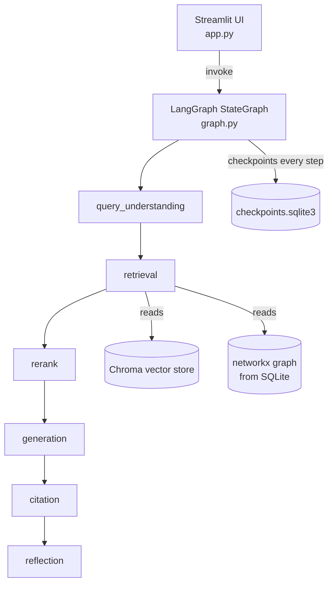
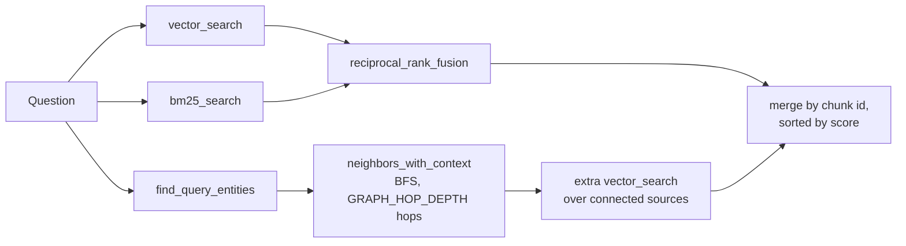

# Architecture

Audited against local checkout `20b6b74eb4499ab612fe6aacbb95138995f195b1` on
`main` (remote `https://github.com/pypi-ahmad/local-first-knowledge-base-agent.git`),
2026-08-17. License: MIT (`LICENSE`). Citations point to files in this
checkout.

## What this is

A local, single-user Streamlit application that indexes personal files
(notes, code, PDFs, images, audio, browser history) and answers questions
about them through a 6-node LangGraph conversational agent, using a hybrid
of vector search, BM25 keyword search, and a local knowledge graph
(`README.md:3`). Everything — the vector store, the metadata database, the
knowledge graph, and conversation memory — is SQLite/Chroma persisted on
disk; nothing is hosted.

## Tech stack

| Layer | Technology | Evidence |
|---|---|---|
| UI | Streamlit | `app.py:10,25` |
| Orchestration | LangGraph `StateGraph`, single compiled graph with a SQLite checkpointer | `graph.py:24-41` |
| LLM/embedding clients | `langchain-core`, `langchain-ollama`, `langchain-openai`, `langchain-google-genai` | `agents/models.py:8-13` |
| Vector store | Chroma (`langchain-chroma`), persisted locally | `retriever/store.py`, `config.py:14` (`CHROMA_DIR`) |
| Keyword search | `rank-bm25`, rebuilt per query from Chroma's own stored docs | `retriever/keyword.py:1-6,21-29` |
| Knowledge graph | `networkx`, rebuilt in-memory from SQLite on every query | `db/graph_store.py:1-6,108-121` |
| Conversation memory | `langgraph.checkpoint.sqlite.SqliteSaver`, module-level singleton | `db/checkpointer.py:16-26` |
| Audio transcription | `faster-whisper` | `indexer/audio_loader.py`, `config.py:78-80` |
| PDF parsing/export | `pymupdf` | `README.md:63` |
| Package management | `uv` | `pyproject.toml`, `run.cmd` |

## Entry point

`uv run streamlit run app.py --server.port 8943`, or `run.cmd` (Windows
one-click: installs `uv` if missing, `uv sync` — creates `.venv` in the
project root, creates `.env`, launches). `app.py` is the only UI entry
point; there is no CLI or API entry point.

## Commands & Verification Inventory

| Command | Purpose | Evidence |
|---|---|---|
| `uv sync` | Install dependencies from `uv.lock` (creates `.venv` in the project root) | `pyproject.toml`, `README.md` |
| `uv run streamlit run app.py --server.port 8943` | Run the app | `README.md:123` |
| `run.cmd` | Windows one-click setup + launch | `run.cmd` |

**No lint, format, typecheck, test, or CI command exists.** No
`pyproject.toml` dev-dependency group for `ruff`/`ty`/`pytest`, no test
directory, no `.github/workflows/` anywhere in the checkout (confirmed by
directory listing, 2026-08-17). Four modules (`db/graph_store.py`,
`db/metadata.py`, and others) do carry a `_demo()` self-check function run
via `if __name__ == "__main__":` — informal, not collected by any test
runner.

## Directory layout

| Path | Purpose |
|---|---|
| `app.py` | Streamlit UI: sidebar (model/sources/filters), 4 tabs (Chat, Timeline & digest, Knowledge report, Privacy & sources) |
| `graph.py` | Builds and compiles the single LangGraph `StateGraph`, with a module-level singleton (`get_graph()`) |
| `state.py` | `KBState` `TypedDict` and its nested `RetrievedDoc`/`Citation`/`SearchFilters` schemas |
| `config.py` | Env var reads, paths, model catalog, tunables |
| `export.py` | Markdown/PDF export (no LLM calls) |
| `utils.py` | Hashing, snippet extraction, date helpers |
| `agents/models.py` | Provider/model factory (Ollama/OpenAI-compatible/Agnes/Gemini); embeddings are always Ollama |
| `agents/nodes.py` | The 6 LangGraph node functions |
| `agents/extraction.py` | One structured LLM call per chunk: entities, relations, and decision/action-item/open-question annotations |
| `agents/proactive.py` | Digests, "mentioned N times" suggestions, conflict detection, topic reports |
| `indexer/loaders.py` | File discovery, text/PDF extraction, generic chunking |
| `indexer/code_parser.py` | AST-aware Python chunking (by function/class) |
| `indexer/image_loader.py` | Ollama vision OCR/captioning |
| `indexer/audio_loader.py` | `faster-whisper` transcription |
| `indexer/browser_history.py` | Chrome/Edge history reader |
| `indexer/pipeline.py` | Incremental indexing orchestration: scan → load → chunk → extract → embed → store |
| `retriever/store.py` | Chroma vector store wrapper |
| `retriever/keyword.py` | BM25 search + reciprocal rank fusion |
| `retriever/rerank.py` | LLM-based re-ranking |
| `retriever/temporal.py` | Relative/explicit/entity-anchored date parsing |
| `retriever/graph_rag.py` | Graph-augmented retrieval: query entities → graph traversal → connected source documents |
| `db/metadata.py` | Indexed-file tracking (mtime+hash), excluded paths |
| `db/graph_store.py` | Entities/relations in SQLite, rebuilt as a `networkx.DiGraph` per call |
| `db/annotations.py` | Decisions/action items/open questions, pinned answers |
| `db/checkpointer.py` | SQLite-backed LangGraph conversation memory |

## Deployment & runtime surface

Local-only; no container, no CI runner image, no deployed service.
`README.md` badges Python 3.14+; no `.python-version`/`runtime.txt` pins an
exact interpreter in this checkout — the floor is asserted only in a
README badge, not enforced anywhere. All persistence (`CHROMA_DIR`,
`METADATA_DB_PATH`, checkpoint DB) lives under `db/data/` (`config.py:13-16`),
created on import if missing.

## EOL / dead-dependency scan

Nothing EOL `[INFERRED — no version pins exist in pyproject.toml to check
against advisory databases]`. One dead-config item found by cross-checking
`config.py` against every other module: `PRICING_USD_PER_1M`
(`config.py`) includes `sonnet-5` and `grok-4.6` entries, but neither model
appears in `config.PROVIDERS` (`ollama`, `openai_compatible`, `agnes`,
`gemini`) or in any provider's model list (`agents/models.py:58-67`) —
`app.py:95-99`'s "Pricing reference" expander renders these two phantom
entries in its table even though a user can never actually select them.
Confirmed live via `grep` for `sonnet-5|grok-4.6` across every `.py` file —
only `config.py` matches.

## Data, APIs, background jobs, CI/CD, testing

- **Data:** Chroma vector store (`db/data/chroma`), a `metadata.sqlite3`
  (file-tracking + knowledge-graph entities/relations + annotations, all
  three schemas coexist in the same file — `db/metadata.py:17-31`,
  `db/graph_store.py:19-36`), and a separate `checkpoints.sqlite3` for
  conversation memory (`db/checkpointer.py:16`).
- **APIs:** none exposed by this app; it is a client of four LLM provider
  APIs (`agents/models.py:36-56`) and the local Ollama server.
- **Background jobs:** none; indexing runs synchronously inside the
  Streamlit "Re-index now" button click (`app.py:128-156`), with a progress
  callback for UI feedback, not async execution.
- **CI/CD:** none exists (see Commands inventory above).
- **Testing:** none collected; a handful of `_demo()` self-checks exist in
  `db/` modules but require manual invocation.

## Architectural blueprint

**Layering:** `app.py` (UI) → `graph.py` (orchestration) → `agents/` +
`retriever/` (domain logic) → `db/` + `config.py` (persistence/env).
Nothing in `agents/`, `retriever/`, or `db/` imports `app.py` or `graph.py`
— one-way by convention, not enforced by any import-linter.

**Cross-cutting concerns**

| Concern | Location | Evidence |
|---|---|---|
| Config/secrets | `.env` via `python-dotenv`, read once at import time | `config.py` |
| Provider routing | one function, `models.build_chat_model(provider, model, local_only)`, is the single choke point | `agents/models.py:36-56` |
| Local-only enforcement | `LocalOnlyModeError` raised inside `build_chat_model` itself, not just hidden in the UI | `agents/models.py:18-19,40-41` |
| Error handling | LLM-dependent helpers (`_expand_queries`, `reflection_node`, `extract_from_chunk`) all catch broad `Exception` and degrade gracefully rather than raising | `agents/nodes.py:94-102,193-194`, `agents/extraction.py:66-67` |

**Inferred ADRs**

- **ADR: Query expansion and re-ranking always run on a local model,
  regardless of the selected generation provider.** *Context:* these are
  retrieval-quality helpers, not user-facing output — sending them to a
  paid remote provider would add cost/latency for no visible benefit.
  *Decision:* `_local_llm()` always resolves to Ollama (`agents/nodes.py:53-59`),
  used by `_expand_queries`, `rerank_node`, and `reflection_node`.
  *Consequences:* if no Ollama model is pulled, these steps degrade to
  no-ops (unexpanded query, unranked truncation, no reflection) rather than
  failing — documented explicitly in the module docstring
  (`agents/nodes.py:4-8`).
- **ADR: SQLite is the single source of truth for the knowledge graph;
  `networkx` is a disposable view.** *Context:* keeping two persistence
  formats in sync (a graph DB and a relational store) is a common source
  of drift bugs. *Decision:* `build_graph()` reconstructs the entire
  `networkx.DiGraph` from SQLite on every call, with no caching
  (`db/graph_store.py:108-121`). *Consequences:* correctness is trivially
  guaranteed (one source of truth); the tradeoff is rebuilding the whole
  graph per query — acceptable at personal-KB scale, an explicit "not yet
  a scaling concern" choice consistent with the BM25 rebuild-per-query
  `ponytail:` comment in the neighboring `retriever/keyword.py:4-6`.
- **ADR: Reflection is informational only — no retry loop.** *Context:* an
  automatic retry-on-low-confidence loop risks unbounded LLM cost.
  *Decision:* `reflection_node` sets `needs_retry` but nothing in `graph.py`
  branches on it — the edge from `reflection` goes straight to `END`
  (`graph.py:38`, `agents/nodes.py:179-181`). *Consequences:* a flagged
  "insufficient" answer still reaches the user as final; the flag is
  surface-level UI signal only, not enforced control flow.

**Governance:** none — no CODEOWNERS, no branch protection, no CI to
protect against in the first place.

**How to add a feature:** add or modify a node function in
`agents/nodes.py`, wire it into `build_graph()`'s edges in `graph.py`,
extend `KBState` in `state.py` if new fields are needed, and update
`README.md`'s "How it works" diagram and project structure tree in the
same change (convention only, nothing enforces it).

## Subsystem deep-dives

### 1. The LangGraph query pipeline (`graph.py`, `agents/nodes.py`)

Six nodes in a strict linear chain, no conditional edges
(`graph.py:33-39`). Unlike a typical LangGraph app with a `MemorySaver`,
this graph is compiled once with a persistent `SqliteSaver`
(`graph.py:41`, `db/checkpointer.py:21-26`) — conversation state survives
not just Streamlit reruns but full process restarts, keyed by
`state["messages"]`'s `add_messages` reducer (`state.py:7,34`) and a
`thread_id` the UI manages as a dropdown of past conversations
(`app.py:194-198`). Every other `KBState` field is fully overwritten by
each node's return dict — only `messages` accumulates.

### 2. Hybrid + graph-augmented retrieval (`retriever/keyword.py`, `retriever/graph_rag.py`, `agents/nodes.py::retrieval_node`)

Three independent signals feed one candidate pool. First, `_expand_queries`
generates up to `QUERY_EXPANSION_COUNT` paraphrases via structured output
from a local model (`agents/nodes.py:90-102`); each paraphrase runs through
`hybrid_search`, which itself fuses vector search and BM25 by reciprocal
rank (`retriever/keyword.py:73-82`, weight from `HYBRID_VECTOR_WEIGHT`).
Second, `graph_augmented_sources` extracts capitalized-phrase candidate
entities from the raw query, matches them against known graph entities,
and BFS-traverses `GRAPH_HOP_DEPTH` hops to find connected source documents
(`retriever/graph_rag.py:16-35`, `db/graph_store.py:124-145`) — this is
what lets a question surface a document that shares no vocabulary with the
query at all, as long as it shares a graph-connected entity. All three
signals merge into one `dict` keyed by chunk id (`agents/nodes.py:110-126`),
sorted by score and truncated to `RETRIEVAL_TOP_K` before re-ranking.

### 3. Incremental indexing pipeline (`indexer/pipeline.py`)

`index_folder` is idempotent and incremental: `metadata.is_unchanged()`
does a cheap mtime+size check before ever touching file content
(`db/metadata.py:63-66`, `indexer/pipeline.py:137-138`) — a full
content-hash comparison only happens implicitly, since a changed
mtime/size always triggers a full re-index of that file rather than a
separate hash check. Re-indexing a file first deletes its prior chunks,
graph relations, and annotations (`indexer/pipeline.py:79-82`) before
re-adding, so a file's knowledge-graph contribution never double-counts
across re-indexes. Files removed from a watched folder are detected by
diffing the current scan against `metadata.list_files()` and cleaned up
symmetrically (`indexer/pipeline.py:150-154`). `deep_extraction` (the
entity/relation/annotation pass) is deliberately optional per-run — cutting
it saves one LLM call per chunk since it's a "bonus layer, not load-bearing
for retrieval" (`agents/extraction.py:6-9`).

## Confidence assessment

| Claim area | Confidence |
|---|---|
| LangGraph pipeline structure, node responsibilities | High — read directly from `graph.py`, `agents/nodes.py` |
| No CI/tests/lint config exists | High — confirmed by directory listing and `pyproject.toml` contents, not inference |
| Hybrid retrieval and graph-augmented retrieval mechanics | High — read directly from `retriever/keyword.py`, `retriever/graph_rag.py`, `db/graph_store.py` |
| `sonnet-5`/`grok-4.6` being unreachable dead config | High — confirmed via `grep` across every `.py` file, not inference |
| Incremental indexing correctness under concurrent/interrupted runs | Inferred — no explicit locking observed in `db/metadata.py`/`db/graph_store.py`; each SQLite connection is opened and closed per call, which is safe for the single-process Streamlit deployment this app targets but not analyzed for concurrent writers |

## Footnotes

- `README.md` — features, tech stack, setup, env vars, "How it works" narrative
- `graph.py` — LangGraph graph construction and singleton accessor
- `state.py` — `KBState` and nested schemas
- `config.py` — env var reads, paths, model catalog, tunables
- `app.py` — Streamlit UI and pipeline wiring
- `agents/models.py`, `agents/nodes.py`, `agents/extraction.py`, `agents/proactive.py` — provider factory, graph nodes, extraction, proactive features
- `indexer/pipeline.py`, `indexer/loaders.py`, `indexer/code_parser.py`, `indexer/image_loader.py`, `indexer/audio_loader.py`, `indexer/browser_history.py` — indexing pipeline and per-source-type loaders
- `retriever/store.py`, `retriever/keyword.py`, `retriever/rerank.py`, `retriever/temporal.py`, `retriever/graph_rag.py` — retrieval subsystem
- `db/metadata.py`, `db/graph_store.py`, `db/annotations.py`, `db/checkpointer.py` — persistence
- `utils.py` — hashing, snippets, date helpers
